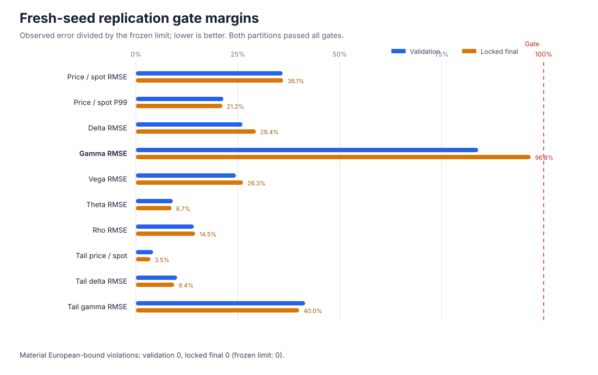
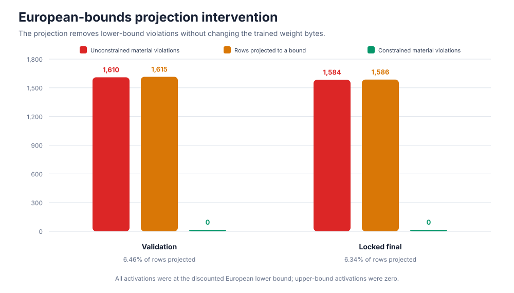
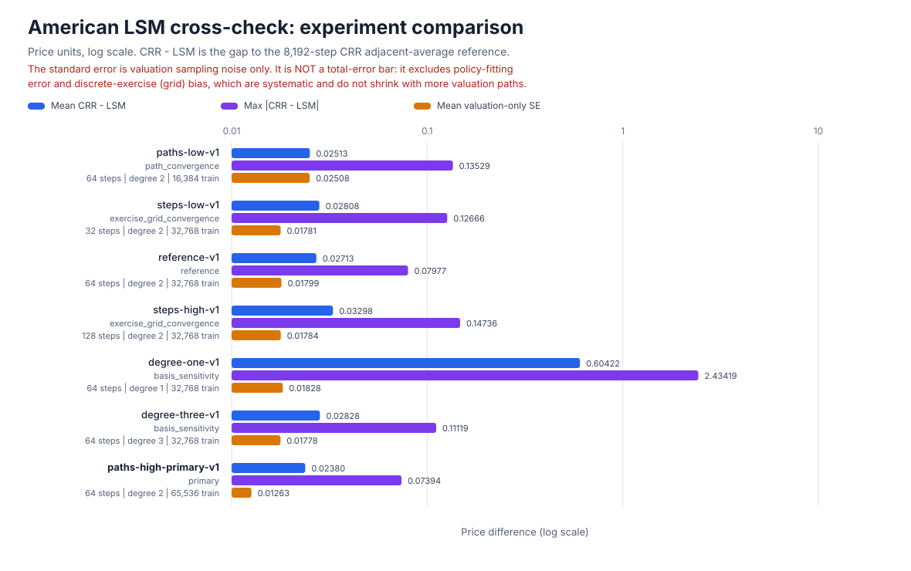
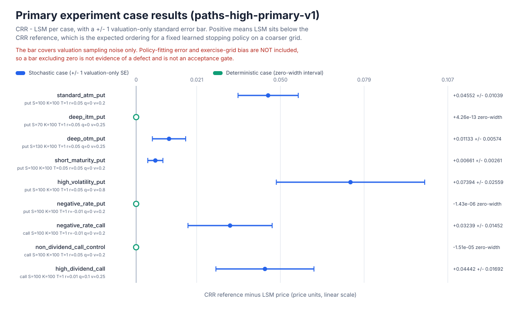
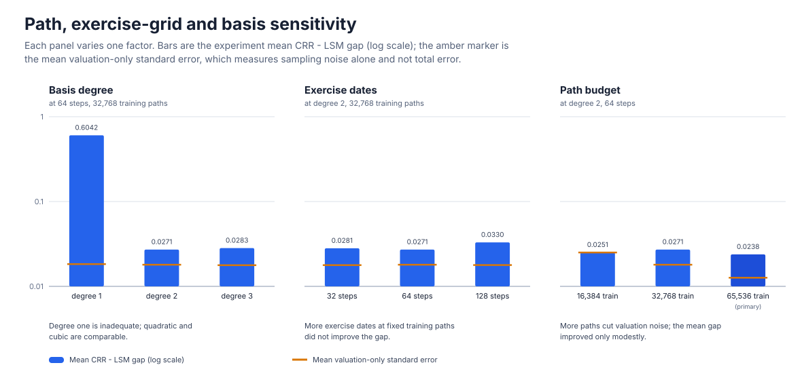
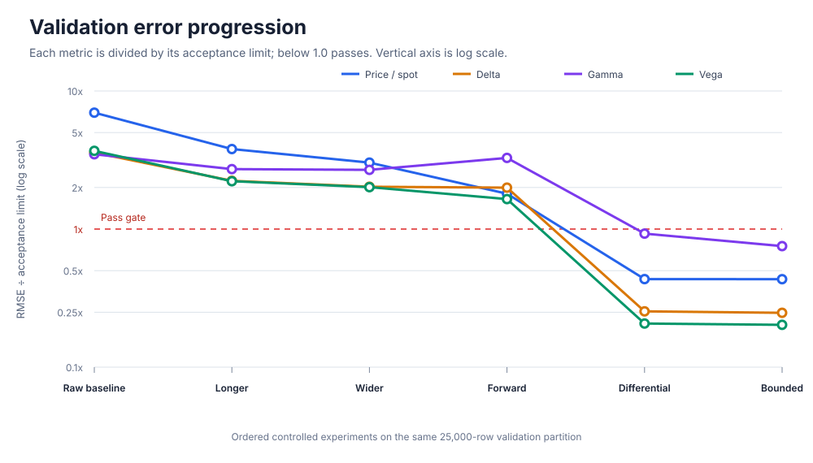
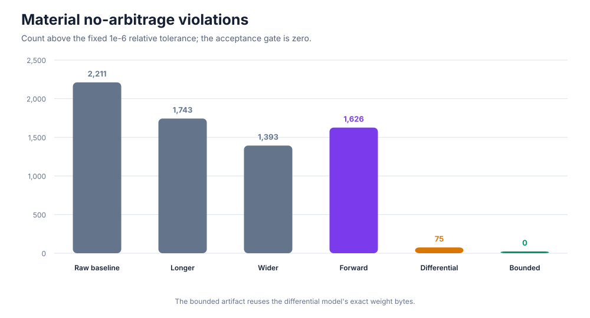

# Differentiable Pricing

A research platform for testing whether neural surrogates can reproduce
derivative prices **and useful risk sensitivities** at materially lower
inference latency than their reference pricers.

The expensive part of re-pricing a book is rarely one price: it is the Greeks,
the scenario grid, and the exercise-aware models behind them. A smooth network
is attractive because one reverse-mode pass returns the value and every input
sensitivity at once. Whether those sensitivities are *trustworthy* is
falsifiable, so the project starts where truth is known and moves outward one
controlled stage at a time.

> A network derivative is exact **for the learned network**, not automatically
> an exact market Greek. It becomes a credible Greek only after feature and
> target normalization are reversed and the result is validated against
> analytic, algorithmic, or convergence-tested bump references.

The first oracle is a C++20 Black–Scholes implementation with analytic Greeks.
Four planned stages add one difficulty at a time — European option, American
option, European swaption, Bermudan swaption — each with its own trusted
reference pricer and a transfer experiment against random initialization. Every
stage must beat acceptance criteria fixed *before* results are observed, on a
partition that has informed no model choice
([docs/research-contract.md](docs/research-contract.md)).

**Stage 1 is complete and independently replicated. Stage 2 now has three
independent reference engines — a CRR tree, an LSM cross-check, and a
discrete-dividend finite-difference PDE oracle — a first label-policy pilot
that selected no policy, and a second, separately predeclared study (task
9C-C3) that **did** select one: `grid_1600x800`, externally approved. A local
continuous-yield CRR dataset is conditionally admitted only for learning its
known mapping; it is not accepted as converged American-price evidence and no
American neural work has run. An accepted label policy is not an accepted
dataset, and both remain separately gated. A parallel real-market
track has audited a three-session quote archive and established which pricer
inputs it can and cannot supply.**

---

## Headline evidence

### Stage 1 complete: fresh-seed European replication

A precommitted protocol was executed once, end to end, on a **newly generated
250,000-row dataset and a new initialization seed**. Architecture, objective,
domain, row counts, optimizer, budget, evaluation bands, output constraint, and
every acceptance gate were bound by SHA-256 before the data existed. Training
and checkpoint selection saw only `train` and `validation`; the fresh
`interpolation_test` was evaluated once and is now permanently consumed.

| Frozen check | Validation | Locked final | Limit | Final budget used |
|---|---:|---:|---:|---:|
| Price / spot RMSE | 0.0001799 | **0.0001805** | 0.0005 | 36.1% |
| Price / spot P99 absolute error | 0.0004290 | **0.0004246** | 0.002 | 21.2% |
| Delta RMSE | 0.002613 | **0.002942** | 0.01 | 29.4% |
| Gamma RMSE | 0.001679 | **0.001937** | 0.002 | 96.8% |
| Vega RMSE | 0.2452 | **0.2627** | 1.0 | 26.3% |
| Theta RMSE | 0.1359 | **0.1311** | 1.5 | 8.7% |
| Rho RMSE | 0.2840 | **0.2901** | 2.0 | 14.5% |
| Tail price / spot RMSE | 0.00006315 | **0.00005324** | 0.0015 | 3.5% |
| Tail delta RMSE | 0.003029 | **0.002817** | 0.03 | 9.4% |
| Tail gamma RMSE | 0.002075 | **0.002002** | 0.005 | 40.0% |
| Material European-bound violations | 0 | **0** | 0 | Pass |



> A fresh-seed differential neural surrogate replicated its synthetic
> in-domain European-option pricing and Greek accuracy, passing all 11
> precommitted validation and locked-final gates with zero material
> European-bound violations.

Three qualifications belong with that claim, not in a footnote.

**Gamma is the least comfortable result.** Its locked-final RMSE consumed 96.8%
of the frozen allowance — a legitimate pass, but curvature is the first metric
to stress in any boundary or out-of-domain study.

**Zero arbitrage violations is structural, not learned.** The trained network
alone violated the discounted lower bound materially on 1,584 locked-final
rows; the deterministic European-bounds projection adjusted 1,586 prices (6.34%
of the partition), all at the lower bound, driving material violations to zero,
with the bounded and unconstrained artifacts sharing one weight digest.



**The six reported Greeks are not six independent confirmations.**

| Greek | Relationship to the training objective |
|---|---|
| Price | Directly supervised. |
| Delta, vega | Directly supervised, through the transformed first derivatives $u_x$ and $u_v$. |
| Rho, theta | Not supervised; algebraic reweightings of the same learned $(u,u_x,u_v)$ on the unconstrained branch, so they chiefly confirm physical-unit reconstruction. |
| Gamma | Not in the objective; requires second-order autograd through $u_{xx}$. First-derivative supervision plausibly regularizes it indirectly, but that is an unablated explanation, not a measured causal result. |
| European bounds | Not learned; imposed structurally by the projection. |

Where the projection is active the reported derivatives follow the active
discounted bound instead, and no derivative is unique exactly at a kink. The
metrics above come from the constrained model that was shipped, so they already
reflect whichever branch applied at each row.

The immutable snapshot
[`docs/results/european_replication_results_v1.json`](docs/results/european_replication_results_v1.json)
records commits, seeds, toolchain, digests, byte-identical weight lineage,
every metric, gate decisions, and the projection intervention; its ledger
records `final_evaluation_attempts = 1` and `status = replication_passed`.
Digests are traceability, not an authenticated attestation of who ran a run.

### Stage 2: two independent American references agree

American work is the active second stage and is so far entirely about
*reference pricers*, not networks. Two numerically unrelated methods price the
same nine pinned regimes: a deterministic **Cox–Ross–Rubinstein tree** refined
to an 8,192/8,193-step adjacent average, and a **Longstaff–Schwartz Monte
Carlo** engine that fits a stopping policy on one antithetic path stream and
values that frozen policy on a second. Seven experiments, 63 case rows;
`CRR−LSM` is in price units against the CRR adjacent average.

| Experiment | Role | Steps | Degree | Train paths | Valuation paths | Mean CRR−LSM | Max abs gap | Mean valuation-only SE | Stochastic cases | In-interval | Deterministic cases | Min applicable VR ratio |
|---|---|---|---|---|---|---|---|---|---|---|---|---|
| `paths-low-v1` | path convergence | 64 | 2 | 16,384 | 32,768 | 0.02513 | 0.13529 | 0.02508 | 6 | 4 | 3 | 1.0096 |
| `steps-low-v1` | exercise grid convergence | 32 | 2 | 32,768 | 65,536 | 0.02808 | 0.12666 | 0.01781 | 6 | 3 | 3 | 1.0001 |
| `reference-v1` | reference | 64 | 2 | 32,768 | 65,536 | 0.02713 | 0.07977 | 0.01799 | 6 | 2 | 3 | 1.0033 |
| `steps-high-v1` | exercise grid convergence | 128 | 2 | 32,768 | 65,536 | 0.03298 | 0.14736 | 0.01784 | 6 | 2 | 3 | 1.0120 |
| `degree-one-v1` | basis sensitivity | 64 | 1 | 32,768 | 65,536 | 0.60422 | 2.43419 | 0.01828 | 6 | 1 | 3 | 1.0345 |
| `degree-three-v1` | basis sensitivity | 64 | 3 | 32,768 | 65,536 | 0.02828 | 0.11119 | 0.01778 | 6 | 3 | 3 | 1.0047 |
| `paths-high-primary-v1` | primary | 64 | 2 | 65,536 | 131,072 | 0.02380 | 0.07394 | 0.01263 | 6 | 0 | 3 | 1.0088 |



The primary experiment `paths-high-primary-v1` reaches a **mean gap of 0.02380
price units and a worst single case of 0.07394**, on option values between 1.4
and 30. Three of the nine cases are deterministic — their valuation estimator
has exactly zero variance — and they agree with the tree to 4.3e-13, 1.4e-06,
and 1.5e-05.



#### How to read the gap without misreading it

LSM sits below the finer-grid CRR reference in **every** stochastic case. That
is the expected ordering, not a defect: for a fixed learned Bermudan stopping
policy the expectation is no greater than the same-grid optimal stopping value.
Three sources of difference must be kept apart, and the reported interval
measures only the first:

* **Valuation noise** — sampling error around an already-frozen policy, the
  `Mean valuation-only SE` column. It shrinks as $n^{-1/2}$: along the path
  ladder it falls 0.02508 → 0.01799 → 0.01263, ratios of 1.3946 and 1.4244 at
  full snapshot precision against the $\sqrt{2}\approx1.4142$ a doubling
  implies — deviations of −1.4% and +0.7%.
* **Policy-fitting bias** — the learned rule is not optimal for its own grid.
* **Exercise-grid bias** — a 64-date Bermudan is not a continuously exercisable
  American.

The last two are systematic and do not shrink with valuation paths, so the
interval has no nominal coverage rate against the CRR reference and
`In-interval` is a diagnostic, **not an acceptance gate**: it falls 4 → 2 → 0
along the ladder precisely because added paths narrow the interval around a
fixed bias, while the point estimates keep agreeing to roughly 0.02 price
units. Deterministic zero-width cases cannot contain a finite-step tree value
however close the agreement, so they are reported separately rather than
converted into successes by an invented tolerance.

#### Sensitivity findings



* **Degree one is inadequate**: the linear basis gives a mean gap of 0.60422,
  more than twenty times the quadratic arm. **Quadratic and cubic are
  comparable** — 0.02713 versus 0.02828, more than an order of magnitude below
  either arm's ≈0.018 mean valuation-only standard error. With one training
  seed per experiment that means "not separated by noise", not "equal".
* **More exercise dates did not help at a fixed path budget**: 32 → 64 → 128
  dates moved the mean gap 0.02808 → 0.02713 → 0.03298, because refining the
  grid adds regression dates without adding paths to fit them on.
* **More paths cut valuation noise but improved the gap only modestly**: along
  the 16,384 → 32,768 → 65,536 training-path ladder it moves 0.02513 → 0.02713
  → 0.02380 — real, small, and **not monotone**, consistent with a residual
  systematic bias.
* **Every applicable finite control variate reduced variance**, minimum ratio
  1.0001, with deterministic cases excluded from that minimum.
* **Regression fallbacks appear in sparse deep-OTM regions**: 4 in the primary
  experiment, all in `deep_otm_put`.

These are consequences of the method, documented in
[docs/american-lsm-contract.md](docs/american-lsm-contract.md), and must not be
tuned away.

#### What the American results do not establish

One-factor geometric Brownian motion with constant rate, dividend yield, and
volatility. All evidence is synthetic: **no market data**, quoted price, or
calibration target enters this study. The CRR reference is an internal
cross-check between two very different numerical methods — **not exact American
truth** and **not market truth** — and agreement with it says nothing about
whether GBM describes live option prices. These results **select no production
label policy**: task 8E predeclares the CRR label-policy calibration study
separately, and nothing here may be reused as its acceptance criterion.

Per-case rows, provenance digests, and declared limitations:
[docs/results/american_lsm_crosscheck_results_v1.json](docs/results/american_lsm_crosscheck_results_v1.json).

### Task 9C: a strong PDE oracle, a useful negative result, and an accepted policy

The tree and the Monte Carlo engine both carry a *continuous* dividend yield,
and a cash dividend is not a yield. Task 9C-A therefore added
`dp::finite_difference_price`: a deterministic one-dimensional Crank–Nicolson
solver with Rannacher damping, an M-matrix upwinding rule, a monotone cubic
Hermite dividend jump, and a projected successive over-relaxation (PSOR) solve
of the American linear complementarity problem, converged on the LCP residual
rather than the iterate change
([docs/pde-numerical-contract.md](docs/pde-numerical-contract.md)).

Task 9C-B then asked one predeclared question: can a fixed grid produce price,
delta, gamma and vega labels by centered price bumps, accurately and stably
enough to supervise a network? Twenty-eight cases — 22 regular, 6 stress —
three candidate policies in a declared order, and frozen caps in
`configs/pde_label_policy_pilot_v1.toml`. The answers point in different
directions and both matter.

**The oracle itself is numerically promising.** Against the study's internal
reference — 3200×1600, selectively Richardson-extrapolated with 1600×800 only
where the observed factor-two order supported it — the 1600×800 candidate met
every predeclared absolute-error cap across all 22 regular cases:

| Label | Worst regular-case error, 1600×800 | Frozen cap |
|---|---:|---:|
| Price | 3.5822e-4 | 5e-4 |
| Delta | 1.7330e-5 | 1e-3 |
| Gamma | 4.5225e-6 | 2e-4 |
| Vega, per unit volatility | 2.9727e-3 | 5e-2 |

**No universal four-label policy was selected.** The frozen recommendation is
`selected_accuracy_policy = no_policy_selected`, with
`criteria_were_not_loosened = true`. The 1600×800 candidate failed 5 of the 22
regular cases on checks that are not error caps: four on Greek bump stability,
where the *reference* delta or vega itself moved across the bump ladder by more
than the frozen variation allowance, and one on the American-dominance shape
check, where a negative-rate American put priced 2.7e-8 below its European
control against a 1e-8 shape tolerance. That gap is of the order of the
solver's own accumulated residual, but a criterion frozen before the run is not
relaxed after it. The cheaper 800×400 candidate failed 11 regular cases and the
Richardson pair 9, so the declared order had no passing member.

**Richardson extrapolation is a validation technique, not a label policy.**
Where the solution is smooth it was the most accurate candidate by an order of
magnitude — worst regular price error 5.056e-5, worst delta 1.03e-6. But the
observed factor-two order fell outside the predeclared `[1.5, 2.5]` support
band in 11 of the 28 cases, concentrated exactly where labels are hardest:
early exercise, discrete dividends, short maturities, and deep-in-the-money
kinks. Unsupported order was preserved as a result rather than repaired by
assuming second order. Ten cases are additionally flagged unsuitable for Greek
supervision while their price rows are retained.

**The operational bottleneck is scalar bump-and-reprice label generation.** The
pilot took 1,638 solves and about 126.6 million PSOR iterations to produce four
labels for 28 states — 2.19 hours of single-core wall time. Extrapolated to
250,000 four-label states that is 104.9 serial hours at 800×400 and 792.5 at
1600×800 (13.1 and 99.1 hours at eight *ideal* workers). Those projections
assume perfect independent-worker scaling and exclude scheduling, memory
contention, failures and dataset I/O: they are evidence that naive scalar
generation is not operationally acceptable, **not** a cluster or production
benchmark.

Every per-case error, check outcome and observed order is frozen in
[docs/results/american_pde_label_policy_results_v1.json](docs/results/american_pde_label_policy_results_v1.json).
The negative result is the pilot working as designed: it priced out a naive
labelling strategy for two hours of compute, not after a dataset had been
generated on it. That snapshot is immutable and is **never** reinterpreted by
what follows.

### Task 9C-C3: the accepted label policy

v1 failed on **stability and shape**, not on accuracy. Task 9C-C3 asked a new,
separately predeclared question on its own versioned config and runner: can a
revised stability/shape rule — explicitly *not* a loosened error cap — pass
those five cases without destabilising the ones v1 already handled? The four v1
absolute-error caps were carried over unchanged, which is what makes the two
studies comparable.

Both stages ran once, manually. Remediation passed all ten cases; the unchanged
28-case confirmation set then ran once and selected **`grid_1600x800`**, with
`criteria_were_not_loosened = true`. A **fresh top-level independent session**
reviewed the frozen evidence and returned **APPROVE POLICY AND FREEZE**.

| Quantity | Regular-case conclusion |
|---|---|
| Price | selected on **22/22** numerically valid regular cases |
| Delta | supervision-eligible on **18/22** |
| Vega | supervision-eligible on **22/22** |
| Gamma | **evaluation-only, 0/22** |

The worst regular price error was **2.6867e-4** against the unchanged **5e-4**
cap. All **323** confirmation solves completed with **zero solver exceptions** —
**176,130** linear solves, **144,086** PSOR solves, **34,888,292** PSOR
iterations, about **1,586.4 seconds** of wall time.

**18/22 delta eligibility is conservative order measurability, not four bad
deltas.** All four excluded cases passed their stencil-delta validation inside
the unchanged 1e-3 cap and were excluded solely because the factor-two
convergence order was unsupported: two have an exactly flat stencil delta
($-1$ and $+1$), which leaves the order **undefined**; one measured about
$23.75$; and `regular_american_one_dividend_call` measured about $3.027$
despite an error of about $9.71\times10^{-7}$. The supported band is not
widened — that would be a post-result criterion change, and would require a
separately versioned task.

Three limits are stated rather than glossed. One stress case,
`stress_euro_short_low_vol_atm`, **fails** its price check descriptively at
**2.9943e-3** with a correspondingly large evaluation-only gamma error; stress
cases decide no selection, and it is kept as honest evidence of a regime where
the policy is not accurate. The negative-rate American-dominance gap passes
only through the predeclared residual-scale-aware **operational** allowance,
which is a price-error scale estimate from the solver's own accumulated LCP
residual and **is not a rigorous error bound**. And **no dataset and no
training input is authorized by the frozen report itself** — an accepted label
policy is not an accepted dataset.

The terminal evidence is
[docs/results/american_pde_label_policy_v2_results_v1.json](docs/results/american_pde_label_policy_v2_results_v1.json)
(SHA-256 `75d9402f071323065f8398ccd2cf427e2fb6fa1e663aef90ec7cbcf9c46a1186`,
from confirmation report
`f9bf3f8fd636498b09fae20df8e42e976c68d2b70b28fdff20ab93752a7e130e`). It is
enforced by `python scripts/freeze_pde_label_policy_v2_results.py --check` in
the gate and in CI, and pinned by
`python/tests/test_pde_label_policy_v2_results_snapshot.py`. Full numbers and
reasoning: [docs/pde-numerical-contract.md](docs/pde-numerical-contract.md),
"Task 9C-C3: label-policy v2".

### Real-market inputs: what a three-session archive can supply (tasks 9A–9B)

A separate track asks where a discrete-dividend American pricer's inputs would
come from on real quotes. It has produced no pricer, no calibration and no
dataset, and every artefact it generates is derived from proprietary
quote-level data and stays out of Git.

**Task 9A** audits a three-session archive read-only: it verifies the SHA-256
manifest before decoding, consults the vendor's per-request completeness
statement, never modifies a raw file, and writes normalized Parquet beneath an
ignored tree. It reports *scoped* capabilities — archive integrity, ingestion
feasibility, XSP European surface readiness, SPY American calibration
readiness, replication readiness — rather than one verdict, over coverage
denominators spanning the whole resolved instrument universe. Its structural
surface minima are properties of the method; its session-count minima were
chosen after the archive was observed and are labelled
`provisional_pilot_target`, not desk-grade.

**Task 9B** fits put-call parity in the same minute, $y = C - P = a + bK$, and
reports what each PDE input's provenance would be
([docs/market-state-reconstruction-contract.md](docs/market-state-reconstruction-contract.md)).
Discount factors and forwards are **pointwise identified at quoted expiries,
with no curve interpolated through those knots**. A non-negative fitted slope is
published as a contradiction rather than clamped, and bid-ask widths weight the
fit as executable-liquidity measures, never as standard errors. The SPY
quantity has exactly one name, the **American parity carry residual**
$Q = S - D\,\mathrm{median}_i\,\tilde{F}_i$, which is not a dividend, a
dividend present value, a borrow rate, a SPY forward, or an independent market
input. The SPY ex-date 2026-06-18 is `officially_scheduled` from the issuer's
published distribution schedule: that fixes the date only, and no dividend
amount is described as observed or inferred anywhere. Variation across the
three intraday snapshots is reported and deliberately not decomposed — it may
combine genuine market movement, quote microstructure, a changing filtered
strike set, and fitting variation.

---

## Project status

| Component | Status | Evidence |
|---|---|---|
| Black–Scholes prices and analytic Greeks (C++20) | Complete | known values, parity, analytic delta, invalid inputs, Python parity |
| Smooth `tanh` MLP with reverse-mode input derivatives (C++20) | Complete | C++ reverse-pass and binding parity tests |
| European dataset generator and diagnostics | Complete | hash-verified manifests, leakage and bound checks |
| European surrogate: price → forward-normalized → differential → bounds-projected | Complete | [validation snapshot](docs/results/european_validation_results_v1.json) |
| Fresh-seed European replication | **Complete, locked, terminal** | [replication snapshot](docs/results/european_replication_results_v1.json) |
| CRR American tree, scalar and parallel batch (C++20) | Complete | bit-identical serial/parallel prices |
| LSM American cross-check (C++20) | **Complete, frozen** | [cross-check snapshot](docs/results/american_lsm_crosscheck_results_v1.json) |
| Discrete-dividend American PDE oracle, scalar, price-only (C++20) | Complete | [PDE contract](docs/pde-numerical-contract.md), refinement ladders, cross-engine tests |
| PDE four-label policy pilot (task 9C-B) | **Complete, frozen — `no_policy_selected`** | [pilot snapshot](docs/results/american_pde_label_policy_results_v1.json) |
| Real-market feasibility audit (task 9A) | Complete, local only | scoped capabilities; no artefact staged |
| Market-state reconstruction (task 9B) | Complete, local only | [reconstruction contract](docs/market-state-reconstruction-contract.md) |
| Valuation-time surface, internally consistent American Greeks (task 9C-C1) | Complete | [PDE contract](docs/pde-numerical-contract.md), scalar-identity, analytic-Greek and free-boundary eligibility tests |
| Grouped spot-row harvesting from surfaces (task 9C-C2a) | Complete, exploratory infrastructure | [PDE contract](docs/pde-numerical-contract.md), identity, pre-solve partitioning, quota and determinism tests |
| Three-surface vega, authoritative external-config verification (task 9C-C2b1) | Complete, exploratory infrastructure | [PDE contract](docs/pde-numerical-contract.md), Task 9C-C2b1 section |
| PDE label-policy v2 (task 9C-C3) | **Complete, frozen — accepted `grid_1600x800`, externally approved** | [v2 snapshot](docs/results/american_pde_label_policy_v2_results_v1.json), [PDE contract](docs/pde-numerical-contract.md) (Task 9C-C3 section), [decision log](docs/decision-log.md) DEC-025 |
| Parallel/resumable production generation (task 9C-C2b2) | **Deferred — not started**; resumed only when the XSP/SPY phase needs dataset-scale PDE generation | [deferred task spec](docs/tasks/active/task-9c-c2b2-parallel-resumable-generation.md), [decision log](docs/decision-log.md) DEC-029 |
| Local data-holdings catalogue and integrity audit (task 9D) | **Complete** — documentation and audit only, admitted nothing | [catalogue](docs/data-holdings-catalogue.md), [task spec](docs/tasks/active/task-9d-data-holdings-audit.md), [decision log](docs/decision-log.md) DEC-031 |
| CRR dataset admission (task 9E) | **Reconciled, conditional** — mapping-only use; cross-check, semantic judgement, and near-duplicate gate not discharged; authorizes no training | [admission record](docs/american-crr-dataset-admission.md), [task spec](docs/tasks/active/task-9e-crr-dataset-admission.md), [decision log](docs/decision-log.md) DEC-034 |
| Private object storage and entitlement-aware vendor ingestion (task 9F) | **On hold** — a plan only, every convention still open | [task spec](docs/tasks/active/task-9f-remote-data-access-plan.md) |
| American neural-pricer feasibility pilot (task 9G) | **Complete, frozen, terminal — negative `failure_to_learn`**; neither arm passed its validation gates, the final partition is unconsumed, and `final-evaluate` is forbidden under that protocol. Fresh top-level review returned `APPROVE TASK 9G RESULT FOR MERGE` | [pilot snapshot](docs/results/american_neural_pilot_results_v1.json), [task spec](docs/tasks/active/task-9g-american-neural-pricer-pilot.md), [decision log](docs/decision-log.md) DEC-038, DEC-039 |
| American price-model development loop (task 9H) | **Active — adaptive exploratory development; infrastructure implemented, nothing run.** `train`/`validation` only, price only; selects against validation, so it produces **no project result** | [task spec](docs/tasks/active/task-9h-american-pricer-development.md), [attempt log](docs/attempts/task-9h-attempt-log.jsonl), [decision log](docs/decision-log.md) DEC-041 |
| The local candidate CRR dataset (continuous dividend yield) | **Catalogued and conditionally admitted only for learning the known CRR mapping**; still not regenerable from tracked sources | Git-ignored, untracked; generator on an unmerged branch; [catalogue](docs/data-holdings-catalogue.md), [admission record](docs/american-crr-dataset-admission.md) |
| An accepted, versioned American training dataset | Not started | separately gated; **not** authorized by the accepted label policy |
| American neural training, transfer; swaption stages 3–4 | Not started | no American neural surrogate has yet been trained and accepted |
| C++ artifact loading and deployment | Not implemented | `SmoothMlp` inference only |
| Latency claims; calibrated curves and surfaces; OOD partitions | Not established | benchmarks are evidence, not gates |

No generated dataset, weight file, raw study report, or market-derived artefact
is checked in. The repository carries versioned snapshots under `docs/results/`
and deterministic, CI-checked SVG figures under `docs/figures/` rendered from
those snapshots alone.

---

## Architecture

```text
cpp/ bindings/python/ python/   C++ core, pybind11 boundary, Python package
configs/                        Versioned experiment assumptions
docs/                           Contracts and research protocol
docs/results/ docs/figures/     Frozen snapshots and rendered plots
scripts/                        Developer checks and study runners
.claude/ .githooks/ .github/    Review agents, local hooks, CI
```

**C++** owns reference pricing and analytic sensitivities, CRR early-exercise
pricing with a parallel price-only batch boundary, LSM policy fitting and
valuation, the finite-difference PDE oracle with discrete cash dividends and
its valuation-time price/delta/gamma surface, input validation, and
reverse-mode derivatives of the deployed network. **Python**
owns sampling, partitioning, lineage, training, evaluation, study runners, and
the read-only market pipelines. Pricing formulas are never duplicated in Python
to make a test pass. [docs/architecture.md](docs/architecture.md).

---

## Quick start

Prerequisites: CMake 3.20+, a C++20 compiler (recent GCC, Clang, or MSVC),
Python 3.11+, and Git.

```bash
# C++ core only
cmake -S . -B build/dev -DDP_BUILD_PYTHON_BINDINGS=OFF -DDP_WARNINGS_AS_ERRORS=ON
cmake --build build/dev --parallel
ctest --test-dir build/dev --output-on-failure

# Python package, compiled extension included
python3 -m venv .venv && source .venv/bin/activate   # Windows: .venv\Scripts\Activate.ps1
python -m pip install --upgrade pip
python -m pip install -e '.[dev,train]'

# Full local gate: configs, protocols, snapshots, figures, C++ tests, Python
# suite (Ruff and clang-format run only where each tool is installed)
./scripts/check.sh
```

The `train` extra adds PyTorch and is required by everything under
`python/tests/ml/`; for dataset work without it install `.[data,dev]`, and the
optional `market` extra adds the vendor DBN reader only the real ingestion
pipeline needs. `./scripts/check.sh` runs `ruff check` only when `ruff` is
importable and `clang-format --dry-run --Werror` only when `clang-format` is
installed — neither is unconditional. The script exits on the first failing
command, so the C++ and Python test stages are reached only once every
preceding enabled check has passed. Full (non-quick) mode always configures
and builds C++ fresh and runs the C++ tests, then the full Python suite,
which needs the editable install — a missing pytest fails the gate rather
than skipping the Python suite. `--quick`, used by the pre-commit hook, skips
the Python suite and runs the C++ tests **only if `build/check` already
exists** from a prior full run; on a fresh clone without it, `--quick` may
perform no C++ test execution at all before exiting. **GitHub Actions CI
remains the authoritative clean-environment gate**, since local results
depend on machine state. Use `-DCMAKE_BUILD_TYPE=Release` for any recorded
performance experiment.

The pricers emit machine-readable JSON:

```bash
./build/dev/dp_pricer call 100 100 1 0.05 0 0.20
./build/dev/dp_american_pricer american put 100 100 1 0.05 0 0.20 2048
```

The American executable reports the $N$- and $(N+1)$-step tree prices, their
average, their absolute gap, and exercise-region diagnostics. That adjacent gap
is a refinement diagnostic, **not** a pure parity measure or a certified error
bound ([docs/american-crr-contract.md](docs/american-crr-contract.md)).

---

## Reproduce the European study

All commands assume the editable install. Generated datasets, artifacts, and
reports are gitignored by design.

### Generate and diagnose the dataset

```bash
python -m differentiable_pricing.data.generate \
  --config configs/european_option_dataset_v1.toml \
  --output data/european-option-v1

python -m differentiable_pricing.data.diagnose \
  --dataset data/european-option-v1 \
  --output data/european-option-v1/diagnostics.json
```

Generation writes three splits plus a timestamp-free `manifest.json` recording
schema and generator versions, the seed derivation, the configuration SHA-256,
the oracle identity, units and conventions, row counts, and a SHA-256 per file,
so the same configuration and toolchain reproduce byte-identical output. Every
label comes from the compiled C++ oracle, and partitions are drawn from
independent streams rather than random-split from one table.

The sampling box is a **provisional synthetic engineering range, not a
calibrated market distribution**. Because the three factors are drawn
independently, a minority of rows land in the short-maturity, low-volatility,
deep-moneyness corner where the price underflows towards zero and delta
saturates; the manifest's `label_diagnostics` block counts them per partition.
Those **extreme-$z$ rows must be evaluated as their own slice**: they price to
within float64 noise of intrinsic value, so relative price error over them is
meaningless.

The diagnostic tool hashes *every* declared Parquet file **before** opening any
of them, then reports per-split statistics, standardized-moneyness bands,
rowwise no-arbitrage checks, and leakage checks on duplicate identifiers and
duplicate **economic states**. These are dataset diagnostics, not
model-performance metrics: a clean report is a precondition for an experiment,
not the result of one.

### Train, constrain, and evaluate

Training reads and verifies only `train.parquet` and `validation.parquet`; it
never opens `interpolation_test.parquet`.

```bash
python -m differentiable_pricing.ml.train \
  --dataset data/european-option-v1 \
  --config configs/european_neural_forward_differential_v1.toml \
  --output artifacts/european-neural-forward-differential-v1

python -m differentiable_pricing.ml.constrain \
  --artifact artifacts/european-neural-forward-differential-v1 \
  --output artifacts/european-neural-forward-differential-bounded-v1

python -m differentiable_pricing.ml.evaluate \
  --dataset data/european-option-v1 \
  --artifact artifacts/european-neural-forward-differential-bounded-v1 \
  --partition validation \
  --output artifacts/european-neural-forward-differential-bounded-v1/validation-evaluation.json
```

Substitute `european_neural_baseline_v1.toml`, `european_neural_long_v1.toml`,
`european_neural_wide_v2.toml`, or
`european_neural_forward_normalized_v1.toml` for the earlier arms.

Every run is CPU-only and float64, fits all feature and target scales on the
training partition alone, and uses only dense layers, `tanh` hidden
activations, and one linear output — matching the C++ `SmoothMlp` contract.
Reference Greek columns are never features, and artifacts follow the versioned
format in [docs/architecture.md](docs/architecture.md). Repeated training is
byte-identical in one fixed runtime, but PyTorch promises nothing across
releases or thread configurations, so a changed runtime is a new experiment
even with the same seed. `constrain` is not another training run: it verifies
the source artifact, copies `weights.npz` byte-for-byte, records the source
digests, and refuses to overwrite a directory or stack the same constraint
twice.

### The mathematics the code implements

The **forward-normalized representation** uses the exact homogeneity of the
Black–Scholes price to reduce seven raw inputs to three economic coordinates,
for spot $S$, strike $K$, maturity $T$, rate $r$, dividend yield $q$, and
volatility $\sigma$:

$$
F = S e^{(r-q)T}, \qquad
x = \log(F/K), \qquad
v = \sigma\sqrt{T}, \qquad
A = S e^{-qT}.
$$

The network learns $u = V/A = f(\text{option type}, x, v)$ and the wrapper
reconstructs $V = A u$ inside the PyTorch graph, so physical-unit Greeks still
follow from autograd. **Differential training** adds first-derivative
supervision — analytic delta and vega labels fix $u_x,u_v$ exactly — and the
**bounds projection** then clips the price into the discounted European
interval, changing the output contract only, never the weights. Every identity,
including those labels, the algebraic rho/theta reconstruction and the bound
definitions, is written out in
[docs/architecture.md](docs/architecture.md#stage-1-european-surrogate-model).

### What the controlled experiments showed

These values come from the same 25,000-row `validation` partition and therefore
describe **model selection, not a locked final evaluation**. Each row changes
one main factor relative to its control — the capacity arms hold seed, batch
size, optimizer, learning rate, weight decay, dtype, device, and feature order
fixed — and thresholds live in `configs/european_neural_acceptance_v1.toml`.

| Experiment | Main controlled change | Price/spot RMSE | Delta RMSE | Gamma RMSE | Material bound violations | Gate result |
|---|---|---:|---:|---:|---:|---|
| Raw baseline | 3×64, price-only, seven raw inputs | 0.003482 | 0.03577 | 0.006962 | 2,211 | Fail |
| Longer | Same model, 100 → 300 epochs | 0.001898 | 0.02236 | 0.005432 | 1,743 | Fail |
| Wider | Four 128-unit layers | 0.001515 | 0.02025 | 0.005368 | 1,393 | Fail |
| Forward | 3×64 on $(\text{type},\log(F/K),\sigma\sqrt{T})$ | 0.0009008 | 0.01995 | 0.006551 | 1,626 | Fail |
| Differential | Add analytic delta/vega supervision | 0.0002171 | 0.002536 | 0.001854 | 75 | Arbitrage only |
| Bounded | Project unchanged differential weights onto $[L,U]$ | **0.0002168** | **0.002474** | **0.001504** | **0** | **Pass** |





- **More of the same was not enough**: more epochs and more width improved
  price and delta, yet every gate still failed by a wide margin.
- **Financial coordinates mattered more than width for price**: forward
  normalization gave the strongest price-only improvement — and made gamma
  *worse*, so accurate prices do not imply accurate curvature.
- **Differential supervision was the decisive learning change**, cutting price,
  delta, vega, theta, and rho errors several-fold to nearly an order of
  magnitude, and carrying gamma — the one genuinely out-of-objective signal —
  across its gate.
- **Structure removed the remaining failure without retraining**: 76 of 25,000
  rows (`0.304%`) were projected, all onto the lower bound, weights
  byte-identical.

These versioned gates were used during the development study, but their
chronology is **not** independently established by repository history: the
configuration and the results arrive in the same change set. The fresh-seed
protocol fixes that by binding the same acceptance configuration by SHA-256 in
a protocol-only commit. Plotted inputs and intervention counts:
[`docs/results/european_validation_results_v1.json`](docs/results/european_validation_results_v1.json).

```bash
python scripts/plot_european_validation_results.py          # regenerate
python scripts/plot_european_validation_results.py --check  # CI staleness gate
```

### The frozen replication protocol

`configs/european_neural_replication_protocol_v1.toml` is the lock behind the
headline result: it binds the development result, both dataset configurations,
the training configuration, the acceptance gates, the projection, and the
one-shot final-evaluation policy. Both new seeds are the first unsigned 32 bits
of SHA-256 over public labels recorded in the protocol, so no favourable seed
could be chosen after seeing a result.

```bash
python scripts/check_european_replication_protocol.py       # validate the lock only
python scripts/run_european_replication.py run-to-validation
python scripts/run_european_replication.py status
python scripts/run_european_replication.py final-evaluate \
  --confirm-locked-final-evaluation                          # one-shot, terminal
python scripts/plot_european_replication_results.py --check
```

`run-to-validation` generates and diagnoses the fresh dataset, trains the frozen
model, derives the bounded artifact, and evaluates `validation` against every
frozen gate; it never touches `interpolation_test`. Pre-existing output paths
are a hard failure — there is no overwrite or resume flag — and the runner
records a final-evaluation attempt *before* starting it, so an interruption
still consumes the single permitted attempt. The audit ledger at
`runs/european-neural-replication-v1/execution.json` records commits, clean
`main`/`origin/main` state, runtime versions, commands and outputs, artifact
lineage, digests, and gate decisions.

**Protocol v1 is terminal.** Its final partition was consumed exactly once and
a future change needs a new protocol and a newly generated final partition
([docs/research-contract.md](docs/research-contract.md)).

Evaluation reports give MAE, RMSE, p95, p99, and maximum absolute error
overall, by call/put, and by standardized-moneyness band. Price error is
divided by spot, never by option price, because near-zero prices make that
ratio unstable. A constrained artifact additionally reports bound activations,
maximum adjustment, and the unconstrained network's own metrics, so the
intervention stays visible.

---

## Reproduce the American studies

All four studies are deliberately **outside CI** because their production-sized
grids are expensive. Reinstall the editable package after changing the C++
binding, then:

```bash
python -m differentiable_pricing.american.convergence \
  --config configs/american_crr_convergence_v1.toml \
  --output artifacts/american-crr-convergence-v1.json

python -m differentiable_pricing.american.lsm_crosscheck \
  --config configs/american_lsm_crosscheck_v1.toml \
  --output artifacts/american-lsm-crosscheck-v1.json

python -m differentiable_pricing.american.pde_refinement

python scripts/demo_pde_valuation_surface.py
```

The **CRR convergence report** covers named exercise regimes over a step ladder
against the internal 8,192/8,193-step average, with exercise-boundary samples,
analytic European controls, both signs of rate for no-dividend calls, and the
strict $0<p<1$ minimum-feasible-step distribution over a separate
$(T,r,q,\sigma)$ grid. It records build provenance but no wall-clock fields, so
numerical diagnostics never mix with machine-specific performance evidence. The
high-step average is a refinement reference from the same algorithm, not
independent truth — which is why the LSM cross-check exists
([docs/american-crr-contract.md](docs/american-crr-contract.md)).

The **LSM cross-check** reuses nine SHA-256-pinned CRR regimes and varies path
count, exercise-grid density, and polynomial degree one factor at a time. The
engine treats each antithetic pair average as one independent sample, reports
raw and control-variate standard errors with a 95% interval, and refuses a
training request whose estimated working set exceeds the configured limit.
Formulas, bias decomposition, RNG contract, regression method, and memory
accounting: [docs/american-lsm-contract.md](docs/american-lsm-contract.md).

The **PDE refinement study** reports how the oracle's price moves as the spot
grid, the time grid, and the truncated domain are refined, one axis at a time
and then jointly. It selects nothing.

The **valuation-time surface demonstration** asks 32 interior spots of one
European solve and one American solve, and reports the grid, the query count,
the single backward induction behind them, the PSOR iterations, the Greek
eligibility and exercise counts, and the worst difference against Black--Scholes
or against the CRR engine and a refined grid. It is a correctness
demonstration, not a throughput claim, and it selects nothing.

Refreeze the LSM evidence and its figures only from a reviewed report:

```bash
python scripts/freeze_american_lsm_results.py \
  --report artifacts/american-lsm-crosscheck-review-fixed-v1.json \
  --output docs/results/american_lsm_crosscheck_results_v1.json --update
python scripts/plot_american_lsm_results.py

python scripts/freeze_american_lsm_results.py --check   # CI-safe, artifacts/ absent
python scripts/plot_american_lsm_results.py --check
```

### The label-policy pilot

The task 9C-B pilot is the most expensive study here — 2.19 hours of measured
single-core wall time — and is run only when its numerical evidence is
requested. The second command recomputes every price while reusing the first
run's measured timing block, so all deterministic JSON and CSV output can be
compared byte for byte:

```bash
python -m differentiable_pricing.american.pde_label_policy \
  --config configs/pde_label_policy_pilot_v1.toml \
  --output-directory artifacts/pde-label-policy-pilot-v1-run1
python -m differentiable_pricing.american.pde_label_policy \
  --config configs/pde_label_policy_pilot_v1.toml \
  --output-directory artifacts/pde-label-policy-pilot-v1-run2 \
  --performance-source artifacts/pde-label-policy-pilot-v1-run1/report.json \
  --verify-identical-to artifacts/pde-label-policy-pilot-v1-run1
```

Its frozen outcome is already in the repository, so nothing in CI or the local
gate reruns it; the checked-in snapshot is digest-pinned by
`python/tests/test_pde_label_policy_results_snapshot.py`.

### The label-policy v2 stages (task 9C-C3)

The v2 criteria are predeclared and versioned in
`configs/pde_label_policy_pilot_v2.toml`. **Both stages have now been run, once
each, and the snapshot is frozen and externally approved** — see "Task 9C-C3:
the accepted label policy" above. The commands below are recorded for
auditability; **they are not rerunnable.** The task is one-shot and terminal:
its cases are consumed evidence, and the runner refuses a nonempty output
directory. Both were manual, terminal-invoked jobs. The remediation stage runs
ten cases, of which nine decide pass/fail:

```bash
python -m differentiable_pricing.american.pde_label_policy_v2 \
  --config configs/pde_label_policy_pilot_v2.toml \
  --stage remediation \
  --output-directory artifacts/pde-label-policy-v2-remediation
```

The confirmation stage **refuses to start** without a passing remediation
report carrying the same raw-config and criteria digests, so a criterion
edited after a result cannot reach it:

```bash
python -m differentiable_pricing.american.pde_label_policy_v2 \
  --config configs/pde_label_policy_pilot_v2.toml \
  --stage confirmation \
  --remediation-report artifacts/pde-label-policy-v2-remediation/report.json \
  --output-directory artifacts/pde-label-policy-v2-confirmation
```

Every terminal outcome is frozen from a reviewed raw report by its own tool,
never by hand, and the tool always names its mode. Nothing published in a
report is trusted: `--extract` recomputes every per-case verdict, Greek
eligibility, aggregate count and lifecycle field from the raw per-solve
numbers, against the checked-in configuration, and reconciles every
executable-source digest against the repository. `--check` does the same for
the snapshot and fails when the snapshot it enforces is absent. Now that the
snapshot exists, `--check` is the **designated** validator and runs in
`./scripts/check.sh` and in CI, once each, reading only checked-in files.
Neither mode re-solves, so neither can authenticate a fully coordinated
fabricated numerical report; that limit is published in the snapshot itself.

```bash
# A remediation-terminal outcome freezes from the remediation report;
# a confirmation-terminal outcome freezes from the confirmation report.
python scripts/freeze_pde_label_policy_v2_results.py \
  --extract \
  --report artifacts/pde-label-policy-v2-remediation/report.json \
  --output docs/results/american_pde_label_policy_v2_results_v1.json
python scripts/freeze_pde_label_policy_v2_results.py --check
```

Full criteria — the per-increment fixed-bump tolerances and combined budget,
the grid-stencil delta validation, the residual-scale-aware shape allowances,
the role-aware decision matrix that keeps a Greek-specific failure from ever
vetoing a valid price policy, and the three-state lifecycle — are in
[docs/pde-numerical-contract.md](docs/pde-numerical-contract.md), "Task 9C-C3:
label-policy v2".

### Benchmarking the CRR paths

```bash
python scripts/benchmark_american_crr.py \
  --config configs/american_crr_convergence_v1.toml \
  --steps 1024 --batch-sizes 1,16,64 --thread-counts 1,2,4 \
  --warmups 1 --repetitions 5 \
  --output artifacts/american-crr-benchmark-local.json
```

The report records every repetition plus CPU affinity, platform, compiler,
build configuration, batch size, and effective worker count, and requires
identical prices from every configuration. Timings are never checked in or used
as CI gates. This utility times individual CRR paths; it is **not** the task 9G
label-generator comparator. The pilot benchmark must time the actual
`0.5 * (CRR(N) + CRR(N+1))` operation under matched request shapes, batches,
thread budgets, warm-ups, repetitions, and recorded hardware/software metadata.

---

## Reproduce the market studies

Both need the private archive and the `market` extra, both write only beneath
ignored trees, and neither runs in CI: the market tests build vendor-encoded
fixtures programmatically and skip decode-backed cases when the extra is
absent.

```bash
python -m pip install -e '.[dev,market]'

python -m differentiable_pricing.market.ingest \
  --config configs/market_feasibility_v1.toml \
  --output artifacts/market-feasibility-v1-audit3/feasibility-report-v3.json

python -m differentiable_pricing.market.reconstruct \
  --config configs/market_state_reconstruction_v1.toml
```

The reconstruction verifies the 9A configuration, report, and raw-manifest
digests before any arithmetic and aborts with nothing written on a mismatch.
Its report, tables, and figures are derived from proprietary quote-level data:
never stage them, nor any fitted curve or inferred market value.

---

## Methodology, contracts, and frozen evidence

| Document | Contents |
|---|---|
| [docs/research-contract.md](docs/research-contract.md) | Hypotheses, stage reference standards, data protocol, metrics, replication gates, non-claims |
| [docs/architecture.md](docs/architecture.md) | Language boundary, snapshot discipline, artifact contract, stage-1 model math |
| [docs/american-crr-contract.md](docs/american-crr-contract.md) | Lattice, recursion, exercise metadata, complexity, convergence semantics |
| [docs/american-lsm-contract.md](docs/american-lsm-contract.md) | Estimand, policy/valuation separation, uncertainty, control variate, overflow rejection |
| [docs/pde-numerical-contract.md](docs/pde-numerical-contract.md) | Discrete-dividend PDE oracle: equation, discount interpolation, dividend jump, boundaries, PSOR residual, complexity, scope, the 9C-B pilot design, the 9C-C1 valuation-time surface with its derivative, classification and Greek-eligibility rules, and the 9C-C2a identity, grouped-partitioning and exact-node harvesting contract, plus the 9C-C3 label-policy v2 predeclaration and its accepted terminal result |
| [docs/market-state-reconstruction-contract.md](docs/market-state-reconstruction-contract.md) | Parity fitting, identifiability classes, forbidden names, task 9C input contract |
| [docs/agentic-workflow.md](docs/agentic-workflow.md) | Agent roles, guardrails, review loop |
| [AGENTS.md](AGENTS.md) | Durable, cross-tool operating contract: mission, source-of-truth hierarchy, git/data safety, bounded workflow, review-independence rule |
| [CLAUDE.md](CLAUDE.md) | Concise Claude Code entry point that imports `AGENTS.md`: hooks, subagents, model routing, command routing — not a restatement of numerical rules |

Three disciplines run through all of them.

**Partition roles are enforced, not assumed.** `validation` selects
architecture and hyperparameters; `interpolation_test` must be named explicitly
and is never tuned against. Once any result informs a model change that split is
consumed and a fresh-seed replication is required for the final estimate.

**Expensive evidence is frozen, not transcribed.** A snapshot family's
generator checks the raw report against an exact key schema, recomputes every
summary from its own rows, extracts each number programmatically, and emits
canonical timestamp-free JSON. Every `--check` runs in CI on checked-in files
only, so no gate depends on an ignored artifact.

**Agent-assisted engineering is part of the method, and it is constrained.** A
deterministic post-edit hook validates edited files without rewriting them, and
two read-only clean-context agents (`code-reviewer`, `numerical-reviewer`)
return findings on a diff without touching it. They produce evidence, not
authority: deterministic tests, CI, and human ownership of assumptions and
claims remain decisive
([docs/agentic-workflow.md](docs/agentic-workflow.md)).

---

## Limitations and non-claims

- **Every learned result is synthetic.** No market data, quoted price, or
  calibration target enters any dataset, training run, or reported metric. The
  market track reads real quotes but produces no price, Greek, label, or
  calibrated model.
- **No calibrated curve or volatility surface exists.** Task 9B identifies
  discount and forward *knots* pointwise at quoted expiries; nothing
  interpolates a curve through them, no implied volatility is inverted, and no
  surface is fitted.
- **The real-market evidence is three sessions.** It is a feasibility and
  identifiability study, not a historical market study, and it establishes no
  SPY American calibration capability. Dividend amounts, borrow and carry, and
  corporate-action adjustments are unavailable in that archive; the SPY
  ex-*date* is officially scheduled and its amount is unverified.
- **An accepted PDE label policy exists; the local CRR dataset is conditional.** Task
  9C-B returned `no_policy_selected`; task 9C-C3 then selected `grid_1600x800`
  on a separately predeclared question, and a fresh top-level session approved
  it. That covers **labeling only** — price on 22/22 regular cases, delta on
  18/22, vega on 22/22, gamma not at all. The frozen report authorizes neither
  dataset generation nor training input. Separately, task 9E conditionally
  admitted the existing CRR dataset only for learning its known mapping; its
  independent cross-check and semantic judgement were not performed, and its
  near-duplicate gate cannot be satisfied retroactively. American neural
  training remains gated and not started.
- **In-envelope interpolation only.** No boundary, extrapolation/OOD, or
  scenario-shock partition has been built or evaluated.
- **No latency claim.** Analytic Black–Scholes can easily be faster than this
  network. A speed comparison only becomes meaningful for genuinely expensive
  references — trees, PDE, LSM — and only end-to-end, with feature transforms,
  serialization, batching, and derivative cost all counted. The pilot's worker
  projections assume ideal scaling and are not feasibility claims.
- **No production or deployment claim.** C++ artifact loading is not
  implemented; the shipped inference core is `SmoothMlp` alone.
- **No accepted production American dataset or neural result yet.** The PDE oracle now exposes
  nodewise delta and gamma from its valuation-time slice, cross-checked against
  analytic Black--Scholes on European contracts; for American contracts no
  closed form and no second engine in this repository prices a Greek, so those
  are validated by structure, obstacle identities and a refinement control
  rather than against truth. An accepted label policy now exists, but no
  accepted PDE-labelled American dataset and no American neural result do. The
  local CRR dataset's conditional, mapping-only admission is not a converged-
  price claim.

---

## Tasks 9C-C1 and 9C-C2a: the valuation-time surface, its rows, and what comes next

The pilot located the cost precisely: four labels per state took thirteen
scalar solves at one grid — a center plus three symmetric bump pairs per axis —
and every one of them discarded the whole valuation-time solution to keep a
single number. **Task 9C-C1 is implemented.** One backward induction now
returns the valuation-time slice $V(S_i)$ with, per node, delta and gamma read
off that slice by second-order differences in the actual node coordinates, the
exercise/continuation classification certified against the solver's own LCP
residual scale, and a Greek-eligibility rule fixed in code before any surface
number was inspected: no one-sided boundary derivative, a declared domain-edge
buffer, a refusal of every node whose own exercise state the solver cannot
certify, and a five-node regime stencil that refuses any node whose
neighbourhood crosses the free boundary or a numerically indifferent band. Many requested
spots are evaluated against that single solve, in the order asked for, with no
extrapolation outside the solved domain. The scalar API, its results and its
$O(N_S)$ working memory are unchanged — a surface query at the scalar spot
reproduces the scalar price bitwise
([docs/pde-numerical-contract.md](docs/pde-numerical-contract.md)).

```bash
python scripts/demo_pde_valuation_surface.py
```

That demonstration asks 32 interior spots of one European and one American
solve. It is a correctness demonstration, not a throughput measurement, and its
wall-clock lines must not be extrapolated to a label budget.

**One surface yielding many rows does not make those rows statistically
independent.** They are correlated outputs of one solve. **Task 9C-C2a** now
implements the machinery that keeps that structural: three versioned canonical
SHA-256 identities (base economic state, canonical actual solver input, harvested node); partition
assignment by economic group *before* any solve, from group identities alone, so
a call/put pair or a future sigma-down/base/sigma-up triple cannot straddle
`train`, `validation` and `interpolation_test`; harvesting of **exact grid
nodes** only, inside a predeclared interior window and outside the structural
boundary buffer, with `exercise_state` and Greek eligibility copied through
untouched and numerically indifferent rows kept for price but never for Greeks;
predeclared per-regime density quotas applied only after a group's partition is
fixed, with every shortfall reported; and a report that states raw rows,
independent design groups and explicit surface-work counts.

The actual-solve identity excludes group and role provenance and includes every
pricing and numerical solver input. Any cross-group or cross-role alias is
rejected before partition assignment; C2a performs no solve reuse. Execution
binds the semantic configuration and returned grid/surface diagnostics back to
that planned identity. Reports separate planned, attempted, successful, failed,
retained and discarded surface counts and recompute membership and partition
integrity before publication.

Rows per *group* and rows per *attempted solve* are reported side by side and are not
interchangeable. In the shipped design each group emits four surfaces, so the
512 rows are 42.67 per design group but only **10.67 per PDE solve** — the
second is the numerical-work multiplier, the first is dataset expansion, and
neither is a statistical effective sample size.

```bash
python scripts/demo_pde_surface_harvest.py
```

That demonstration is exploratory infrastructure on a small synthetic design —
not a production dataset, not a throughput measurement, and not a validation of
any label policy. The group count it reports is a design count, deliberately not
called a statistical effective sample size.

**Task 9C-C2b1 is also implemented.** It closes the gap this section used to
describe as open: authoritative verification of a harvest publication against
an externally supplied expected configuration — not merely self-consistency
against its own stored digests — and three-surface vega, with `sigma_down`,
`base` and `sigma_up` solves sharing one spot grid and matched by exact node.
An available vega additionally carries a `vega_label_record_id`, kept
distinct from the base row's economic `row_id`: the same pricing node under a
different vega convention is not the same label record. Reports also
separate solver-returned surfaces from pipeline-successful ones, so a surface
that solved but failed a later check is not silently counted as a success.
Full rules: [docs/pde-numerical-contract.md](docs/pde-numerical-contract.md).

**Task 9C-C3 is complete and its policy accepted.** Both stages ran once,
manually, against criteria fixed before execution; `grid_1600x800` was selected
and externally approved, and the snapshot is frozen and enforced — see "Task
9C-C3: the accepted label policy" above for the numbers. The design it ran
under is unchanged by the outcome. v2 makes the American dominance and intrinsic
allowances scale with the solver's own absolute accumulated LCP residual —
explicitly as operational price-error scale estimates, not certified bounds —
replaces v1's bump-ladder veto with a single combined
`reference error + bias charge` budget, and takes the production delta from
the task 9C-C1 nodewise stencil at an exact grid node. Its price reference is
the **raw** exact-node centre value of the 3200×1600 rung, unconditionally:
unlike v1 there is no price Richardson extrapolation and no conditional
fallback, and the 800×400 rung is solved only to estimate the delta stencil
order. The confirmation success selected a **price** candidate, with delta and
vega eligibility decided case by case and gamma still evaluation-only; the
fresh top-level approval it was pending has since been given.

**The stage-2 roadmap is now locked** ([docs/decision-log.md](docs/decision-log.md)
DEC-028, stated normatively in
[docs/research-contract.md](docs/research-contract.md), "The locked stage-2
roadmap"), around one question: can a neural surrogate price American options
with useful accuracy while delivering materially faster inference than the
numerical method that generated its labels, and does that speedup support
faster implied-volatility inversion and volatility-surface construction? In
order: (1) a **continuous-dividend-yield American CRR baseline** — learnability,
scratch versus European→American transfer, inference accuracy, scaling against
CRR's O(N^2) lattice cost, and a small implied-volatility/surface
reconstruction; (2) an **XSP/SPY real-instrument study**, with XSP (European,
cash-settled) as the control and SPY (American, discrete deterministic cash
distributions, early exercise) as the target, learning PDE prices and
evaluating real implied-volatility surfaces; (3) a **deferred commodity
extension**, with corn options the leading future candidate. Crypto is
explicitly excluded: European-only crypto options do not advance the
American-option question.

Consequently **task 9C-C2b2 is deferred, not rejected** (DEC-029). Its
specification stays in place and is resumed only when the XSP/SPY phase
requires dataset-scale PDE generation; it still must not claim or launch a
production dataset when it does resume. **Task 9D is complete**: the local data
holdings — the candidate CRR dataset and the Databento/FRED market-data
holdings — are catalogued and integrity-audited in
[docs/data-holdings-catalogue.md](docs/data-holdings-catalogue.md), which admits
nothing (DEC-031). **Task 9E is reconciled as conditional**: the dataset is
admitted only for learning the known continuous-yield CRR mapping, not as
evidence of converged American-price accuracy — see the
[admission record](docs/american-crr-dataset-admission.md) (DEC-034). Its
implemented internal and exact-disjointness checks passed, but the independent
cross-check and semantic-coverage judgement were not performed, and the
near-duplicate gate cannot be satisfied retroactively. Admission authorizes
**no training**. The raw seven-input form is feature-sufficient but not minimal;
task 9G uses `american_forward_carry_v1`: encoded type, `log(F/K)`,
`sigma*sqrt(T)`, `rT`, and `qT`, with target `V/(S*exp(-q*T))`.

**Task 9G is complete, frozen and terminal, with a negative result.** It was one
architecture, one scratch seed, one transfer seed, one budget, no sweep, and
validation-only model selection. Every entry gate passed — the independent PDE
mapping check on 21 of 21 rows, and the exact European-to-American transfer lift
at all eight pinned probes — and then **neither arm passed every validation
gate**: `status=validation_gates_failed`, `outcome=failure_to_learn`. Transfer's
validation RMSE was strictly better than scratch's, but the two arm seeds also
produce different epoch shuffles, so that is a confounded within-pilot
observation and not evidence that transfer initialization helps. **No final
evaluation occurred** (`final_evaluation_attempts = 0`,
`final_partition_consumed = false`) and `final-evaluate` is **forbidden** under
that protocol; any future final evaluation needs a new protocol and a fresh
final partition. One seed and one budget make this a feasibility pilot, not an
H2 test. The frozen evidence is the
[pilot snapshot](docs/results/american_neural_pilot_results_v1.json), approved
by fresh top-level review (DEC-038, DEC-039).

**Task 9H is the exact next task**: adaptive American **price**-model
development on branch `experiment/task-9h-american-pricer-development`. It
iterates on capacity, representation, target and architecture until a price
model meets a fixed development criterion on `train` and `validation` — Task
9G's own normalized RMSE, p99, maximum-error and material bound/shape rule,
reused rather than restated so it cannot be loosened after an attempt fails.
Greeks, latency, implied volatility and transfer learning are separate follow-up
stages that begin only after a candidate works, and none of their machinery is
built in advance. It is **development, not confirmatory research**: it selects
against `validation` repeatedly, so nothing it produces is a project result, and
a candidate that meets the criterion would require a separately predeclared
confirmation on a fresh final partition as its own task. `interpolation_test`
and every other final partition stay inaccessible throughout, and its runner
exposes no final-evaluation command. Its infrastructure exists and **no model
has been trained** (DEC-041).

The deferred plan for private object storage and
entitlement-aware Databento ingestion is **task 9F**, on hold — a plan only,
and licensed OPRA/Databento content is never redistributable.

The local candidate CRR dataset is not accepted as converged-price or market
evidence; its generator is on an unmerged branch and its label policy has no
frozen evidence. It carries
a continuous dividend yield and therefore cannot model SPY cash dividends. No accepted, versioned PDE-labelled SPY training dataset exists, and
no American neural surrogate has yet been trained and accepted. The accepted
policy authorizes neither a dataset nor a training input, and the accepted PDE
label policy remains frozen evidence that the roadmap lock does not reinterpret
or rerun. Gamma is still not training-ready and remains evaluation-only; vega is
supervision-eligible where task 9C-C3 measured it to be. **Task 9C-B remains
`no_policy_selected`** — v2 answered a new question and never reinterpreted it.
**No American neural surrogate has been trained and accepted**: task 9G trained
two arms and accepted neither, and task 9H has trained none. Current state and
the exact next task:
[docs/project-state.md](docs/project-state.md).

---

## Contributing

Read [AGENTS.md](AGENTS.md) (or [CLAUDE.md](CLAUDE.md) if you are using
Claude Code) and [docs/research-contract.md](docs/research-contract.md)
first. Every change should state the numerical assumption it changes, add a
regression test, and pass `./scripts/check.sh`. Full workflow, test-partition
rules, snapshot refresh procedure, and pull-request expectations:
[CONTRIBUTING.md](CONTRIBUTING.md).

### For contributors and coding agents

Start with [AGENTS.md](AGENTS.md) (durable, cross-tool operating rules),
[docs/project-state.md](docs/project-state.md) (the current, living state
and exact next task — more current than the narrative above where they
disagree), and [docs/documentation-map.md](docs/documentation-map.md) (which
document wins when two of them disagree).

## License

MIT; see [LICENSE](LICENSE).
