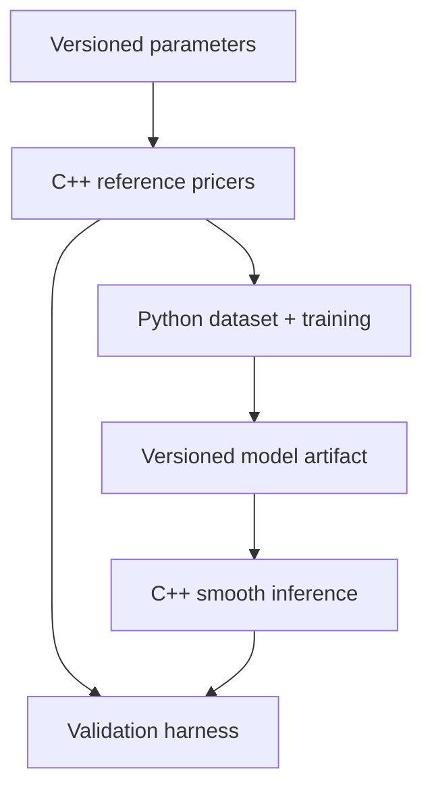

# Architecture

## Boundary of responsibility

The system has one source of truth for pricing logic and a deliberately narrow
language boundary.

### C++

- reference pricing and analytic/numerical sensitivities;
- deterministic early-exercise pricing through the scalar CRR reference tree;
- parallel pricing across independent CRR contracts, with a private rolling
  \(O(N)\) workspace per worker and serial arithmetic inside each tree;
- deterministic LSM policy fitting on antithetic training paths and
  pair-aware valuation on a disjoint streaming path set;
- deterministic validation of contract/model inputs;
- low-overhead model inference;
- reverse-mode derivatives of the deployed smooth network;
- executable and library interfaces suitable for benchmarks.

### Python

- parameter sampling and dataset partitioning;
- Parquet metadata and lineage;
- PyTorch training and checkpointing;
- experiment comparison, calibration plots, and artifact export;
- orchestration of cross-language parity tests.

### Binding

pybind11 exposes C++ functionality to Python. Keep the boundary in primitive
numeric types and contiguous arrays. Avoid Python callbacks in hot pricing
loops. The CRR boundary accepts typed column vectors and returns price, step
count, and lattice probability. The scalar LSM boundary returns the raw and
control-variate estimates, pair-aware uncertainty, exercise counts, memory
accounting, and regression diagnostics. A future training-data boundary may
move to `N x D` float64 arrays when selected input derivatives exist.

## Frozen result snapshots

Expensive study reports live under the ignored `artifacts/` directory. What the
repository carries instead is a compact, strictly versioned **result snapshot**
under `docs/results/`, plus deterministic SVG figures under `docs/figures/`
rendered from that snapshot alone.

Each snapshot family has one generator/validator script in `scripts/` that:

- validates the raw report against an exact key schema, rejecting unknown and
  missing fields and any non-finite economic value;
- recomputes every summary statistic from the underlying rows, so an edited
  report cannot be frozen;
- extracts every number programmatically, never by transcription;
- records the source report's filename and full SHA-256 plus configuration and
  C++ provenance digests;
- writes atomically through a same-directory temporary file and refuses silent
  overwrite without an explicit update flag;
- emits canonical JSON with sorted keys and no wall-clock or environment
  fields, so regeneration is byte-reproducible;
- exits `2` on any validation, provenance, or I/O failure.

Each also offers a `--check` mode that CI runs. **`--check` must not require
the ignored artifact.** It validates the checked-in snapshot on its own terms
and reconciles its recorded digests against current repository files; composite
engine identities are recomputed from the same sources `CMakeLists.txt` hashes,
so no compiled extension is needed either. Figure scripts expose a matching
`--check` that fails when a checked-in SVG is stale.

Current members: the European replication and validation snapshots, and
`american_lsm_crosscheck_results_v1.json`
(`scripts/freeze_american_lsm_results.py`,
`scripts/plot_american_lsm_results.py`).

## Model artifact contract

The export format must be framework-neutral and versioned. It should contain:

- ordered feature names and units;
- feature and target transforms;
- any output constraint, its differentiability contract, and source-artifact
  lineage when it is derived without retraining;
- layer dimensions, activation, row-major weights, and biases;
- training code/data identifiers;
- supported domain;
- validation summary and checksum.

The C++ loader must reject unknown versions, shape mismatches, non-finite
weights, and missing transforms. The current `SmoothMlp` is the executable
mathematical core; persistence is a later, separately tested milestone.

## Derivative chain rule

For normalized features \(z_i=(x_i-\mu_i)/s_i\) and normalized target
\(\hat{y}=(y-\mu_y)/s_y\), the reported input sensitivity is

\[
\frac{\partial y}{\partial x_i}
=
\frac{s_y}{s_i}
\frac{\partial \hat{y}}{\partial z_i}.
\]

Missing this rescaling can produce prices that look correct and Greeks that
are systematically wrong.

## Evolution rules

- Add products behind product-specific interfaces, not conditionals spread
  through a generic pricer.
- Add batch APIs before optimizing individual scalar calls.
- Preserve small analytic fixtures as permanent regression tests.
- Treat conventions and calibration state as data with explicit schemas.
- Benchmark the same request shape and hardware for reference and surrogate.
