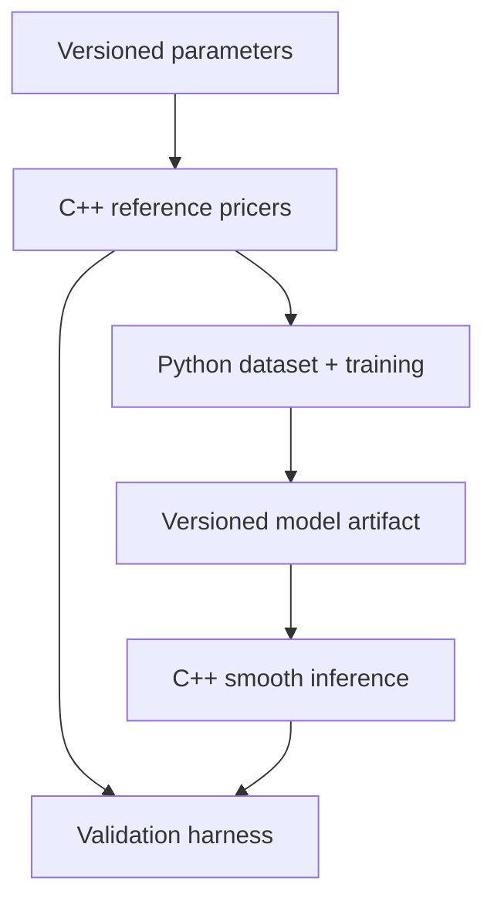

# Architecture

## Boundary of responsibility

The system has one source of truth for pricing logic and a deliberately narrow
language boundary.

### C++

- reference pricing and analytic/numerical sensitivities;
- deterministic validation of contract/model inputs;
- low-overhead model inference;
- reverse-mode derivatives of the deployed smooth network;
- executable and library interfaces suitable for benchmarks.

### Python

- parameter sampling and dataset partitioning;
- Parquet metadata and lineage;
- PyTorch training and checkpointing;
- experiment comparison, calibration plots, and artifact export;
- orchestration of cross-language parity tests.

### Binding

pybind11 exposes C++ functionality to Python. Keep the boundary in primitive
numeric types and contiguous arrays. Avoid Python callbacks in hot pricing
loops. A future batch API should accept an `N x D` float64 array and return
prices plus selected input derivatives.

## Model artifact contract

The export format must be framework-neutral and versioned. It should contain:

- ordered feature names and units;
- feature and target transforms;
- any output constraint, its differentiability contract, and source-artifact
  lineage when it is derived without retraining;
- layer dimensions, activation, row-major weights, and biases;
- training code/data identifiers;
- supported domain;
- validation summary and checksum.

The C++ loader must reject unknown versions, shape mismatches, non-finite
weights, and missing transforms. The current `SmoothMlp` is the executable
mathematical core; persistence is a later, separately tested milestone.

## Derivative chain rule

For normalized features \(z_i=(x_i-\mu_i)/s_i\) and normalized target
\(\hat{y}=(y-\mu_y)/s_y\), the reported input sensitivity is

\[
\frac{\partial y}{\partial x_i}
=
\frac{s_y}{s_i}
\frac{\partial \hat{y}}{\partial z_i}.
\]

Missing this rescaling can produce prices that look correct and Greeks that
are systematically wrong.

## Evolution rules

- Add products behind product-specific interfaces, not conditionals spread
  through a generic pricer.
- Add batch APIs before optimizing individual scalar calls.
- Preserve small analytic fixtures as permanent regression tests.
- Treat conventions and calibration state as data with explicit schemas.
- Benchmark the same request shape and hardware for reference and surrogate.
