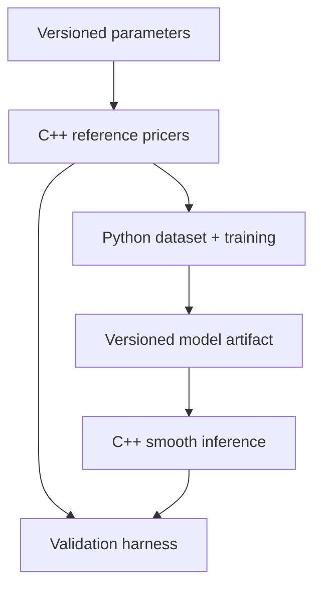

# Architecture

## Boundary of responsibility

The system has one source of truth for pricing logic and a deliberately narrow
language boundary.

### C++

- reference pricing and analytic/numerical sensitivities;
- deterministic early-exercise pricing through the scalar CRR reference tree;
- parallel pricing across independent CRR contracts, with a private rolling
  $O(N)$ workspace per worker and serial arithmetic inside each tree;
- deterministic LSM policy fitting on antithetic training paths and
  pair-aware valuation on a disjoint streaming path set;
- the scalar finite-difference PDE oracle for European and American vanillas
  with explicit discrete cash dividends, bound in its own translation unit so
  the CRR and LSM implementation digests stay byte-stable;
- the valuation-time surface of that same solve: one backward induction
  returning nodewise price, delta, gamma, exercise classification and
  structural Greek eligibility, plus many requested spots evaluated against it.
  Only the final time level is retained, so working memory stays $O(N_S)$;
- deterministic validation of contract/model inputs;
- low-overhead model inference;
- reverse-mode derivatives of the deployed smooth network;
- executable and library interfaces suitable for benchmarks.

### Python

- parameter sampling and dataset partitioning;
- Parquet metadata and lineage;
- PyTorch training and checkpointing;
- experiment comparison, calibration plots, and artifact export;
- study runners over the C++ engines, including the bump-and-reprice label
  policy pilot, which computes no price of its own;
- read-only ingestion and market-state reconstruction of the private quote
  archive;
- orchestration of cross-language parity tests.

### Binding

pybind11 exposes C++ functionality to Python. Keep the boundary in primitive
numeric types and contiguous arrays. Avoid Python callbacks in hot pricing
loops. The CRR boundary accepts typed column vectors and returns price, step
count, and lattice probability. The scalar LSM boundary returns the raw and
control-variate estimates, pair-aware uncertainty, exercise counts, memory
accounting, and regression diagnostics. The `_pde` extension is its own
translation unit. `pde_price` returns the price together with the grid, time
and PSOR diagnostics actually used — no sensitivity. `pde_valuation_surface`
takes no spot at all: it returns the solved valuation-time slice columnwise —
spots, values, deltas, gammas, obstacle slacks, LCP residuals, exercise states
and Greek-eligibility reasons — together with the requested spots evaluated
against that single solve, in the order they were asked for. Greeks that do not
exist are `None` rather than a one-sided substitute. A future training-data
boundary may move to `N x D` float64 arrays when selected input derivatives
exist.

## Frozen result snapshots

Expensive study reports live under the ignored `artifacts/` directory. What the
repository carries instead is a compact, strictly versioned **result snapshot**
under `docs/results/`, plus deterministic SVG figures under `docs/figures/`
rendered from that snapshot alone.

Each snapshot family has one generator/validator script in `scripts/` that:

- validates the raw report against an exact key schema, rejecting unknown and
  missing fields and any non-finite economic value;
- recomputes every summary statistic from the underlying rows, so an edited
  report cannot be frozen;
- extracts every number programmatically, never by transcription;
- records the source report's filename and full SHA-256 plus configuration and
  C++ provenance digests;
- writes atomically through a same-directory temporary file and refuses silent
  overwrite without an explicit update flag;
- emits canonical JSON with sorted keys and no wall-clock or environment
  fields, so regeneration is byte-reproducible;
- exits `2` on any validation, provenance, or I/O failure.

Each also offers a `--check` mode that CI runs. **`--check` must not require
the ignored artifact.** It validates the checked-in snapshot on its own terms
and reconciles its recorded digests against current repository files; composite
engine identities are recomputed from the same sources `CMakeLists.txt` hashes,
so no compiled extension is needed either. Figure scripts expose a matching
`--check` that fails when a checked-in SVG is stale.

Current members: the European replication and validation snapshots,
`american_lsm_crosscheck_results_v1.json`
(`scripts/freeze_american_lsm_results.py`,
`scripts/plot_american_lsm_results.py`), and
`american_pde_label_policy_v2_results_v1.json`
(`scripts/freeze_pde_label_policy_v2_results.py`; no figure script).

`american_pde_label_policy_results_v1.json` is **immutable historical
evidence**, frozen differently from the other snapshot families and
deliberately so. The task 9C-B runner already emits canonical, timestamp-free
JSON that a second run reproduces byte for byte, so the reviewed report is
checked in as-is and pinned by SHA-256 in
`python/tests/test_pde_label_policy_results_snapshot.py`. That test may only
**validate preservation** of this file — it reconciles the configuration and
runner digests the file records against current repository files, which
confirms the frozen bytes still match what the pilot actually consumed and
ran, not that the file is current. This snapshot must **never** be replaced,
refreshed, regenerated, rerun, or reinterpreted, by hand or by script, for
any reason, including a later engine or policy change (see
[decision-log.md](decision-log.md) DEC-003 and `CONTRIBUTING.md`). The PDE
source digests it records are **historical**, describing the engine as it
was when the 9C-B pilot ran — task 9C-C1 changed
`cpp/include/dp/finite_difference_pde.hpp` and
`cpp/src/finite_difference_pde.cpp` afterward — and are deliberately not
reconciled against HEAD nor expected to track it; refreshing them to match a
later build would silently transfer provenance the pilot never had. It
carries no figures. A later numerical-policy or engine question — including
task 9C-C3 — is answered by a new, separately versioned config, runner, and
result snapshot, never by editing, rerunning, or regenerating this one.

`american_pde_label_policy_v2_results_v1.json` (task 9C-C3) is the terminal
evidence of the label-policy v2 study and belongs to the freeze/check family
above, not to the check-in-as-is family v1 belongs to. Its raw confirmation
report is expensive and git-ignored; the designated tool
`scripts/freeze_pde_label_policy_v2_results.py` distils it, and its `--check`
mode — now wired into `scripts/check.sh` and the `python` CI job, once each —
enforces the checked-in snapshot **without** the raw report. `--check` trusts
nothing the snapshot claims: it recomputes every per-case verdict, Greek
eligibility, aggregate count and lifecycle field from the snapshot's own raw
numbers against the checked-in configuration, requires exact canonical
serialisation, and reconciles the **whole** executable-source inventory against
current repository files. That last point is the deliberate difference from v1:
the v2 study is a source-checkout study, so an inventory digest that stops
matching HEAD is an error rather than expected historical drift.
`python/tests/test_pde_label_policy_v2_results_snapshot.py` additionally pins the
snapshot's SHA-256, the consumed report digest, and every eligibility conclusion.
The snapshot is never hand-edited, reformatted, regenerated or refreshed —
including to flip `selection_pending_fresh_top_level_approval`, which is
historical and correct as frozen (see [decision-log.md](decision-log.md) DEC-025,
DEC-027). Neither `--check` nor the test re-solves, so neither can authenticate a
fully coordinated fabricated report; the snapshot states that limit itself.

`american_pde_label_policy_results_v1.json` (task 9C-B, v1) and this v2 snapshot
**coexist permanently**. v1 stays immutable historical `no_policy_selected`
evidence; v2 answers a new, separately predeclared question on a separately
versioned config and runner and does not reinterpret, supersede or correct it.

`american.pde_surface_harvest` (task 9C-C2a) contributes no snapshot either, and
for a different reason: it is exploratory infrastructure whose outputs are a
demonstration, not evidence. It publishes `report.json`, `rows.csv` and a
`manifest.json` written **last** that pins both digests, so an interrupted run
cannot read as a completed dataset. Its outputs are canonical, contain no
timestamp, hostname, path or runtime. Byte identity is claimed only under stated
preconditions: identical TOML bytes, identical source-name provenance (the same
recorded `config_name`), identical runner code and engine, and differences
confined to harmless candidate ordering or chunk size. Identical bytes loaded
under a *different filename* keep the raw and semantic digests, every identity,
every assignment and `rows.csv` unchanged, while `report.json` and its dependent
manifest differ in recorded provenance alone; `verify_semantic_identity` is the
check for that case and `verify_byte_identity` the stricter one. Reordered but
semantically equivalent TOML likewise preserves IDs, assignments and `rows.csv`,
while the exact-source digest deliberately changes the report and manifest.
They belong under ignored `artifacts/`
and are never committed.

Python owns the read-only market pipelines (`market.ingest`,
`market.reconstruct`). They read proprietary quote-level data, write only
beneath ignored trees, and contribute no snapshot to `docs/results/`: nothing
derived from that archive may be committed.

## Model artifact contract

The export format must be framework-neutral and versioned. It should contain:

- ordered feature names and units;
- feature and target transforms;
- any output constraint, its differentiability contract, and source-artifact
  lineage when it is derived without retraining;
- layer dimensions, activation, row-major weights, and biases;
- training code/data identifiers;
- supported domain;
- validation summary and checksum.

The C++ loader must reject unknown versions, shape mismatches, non-finite
weights, and missing transforms. The current `SmoothMlp` is the executable
mathematical core; persistence is a later, separately tested milestone.

## Derivative chain rule

For normalized features $z_i=(x_i-\mu_i)/s_i$ and normalized target
$\hat{y}=(y-\mu_y)/s_y$, the reported input sensitivity is

$$
\frac{\partial y}{\partial x_i}
=
\frac{s_y}{s_i}
\frac{\partial \hat{y}}{\partial z_i}.
$$

Missing this rescaling can produce prices that look correct and Greeks that
are systematically wrong.

## Stage-1 European surrogate model

The shipped stage-1 model is the forward-normalized, differentially trained,
bounds-projected network summarised in the README. Its coordinates are, for
spot $S$, strike $K$, maturity $T$, rate $r$, dividend yield $q$, and
volatility $\sigma$,

$$
F = S e^{(r-q)T}, \qquad
x = \log(F/K), \qquad
v = \sigma\sqrt{T}, \qquad
A = S e^{-qT},
$$

with the network learning $u = V/A = f(\text{option type}, x, v)$ and the
physical wrapper reconstructing $V = A u$ inside the autograd graph.

### Differential labels

Writing $u=V/A$, the analytic delta and vega labels determine the coordinate
derivatives exactly:

$$
u_x=e^{qT}\Delta-u, \qquad
u_v=\frac{\text{Vega}}{A\sqrt{T}}.
$$

These are the supervised first derivatives. They are derived analytically in
the declared coordinates; finite differences are never used as training labels.

### Algebraic Greeks

Rho and theta are reweightings of the same learned $(u,u_x,u_v)$ on the
unconstrained branch:

$$
\rho=\frac{\partial V}{\partial r}=A\,T\,u_x,
\qquad
\theta=-\frac{\partial V}{\partial T}
 =q A u-A(r-q)u_x-\frac{A u_v v}{2T}.
$$

Once $(u,u_x,u_v)$ are fixed at a point, rho and theta are determined there, so
they validate physical-unit reconstruction rather than independent derivative
learning. Gamma requires the out-of-objective curvature $u_{xx}$.

### European bounds projection

For discounted spot $A=Se^{-qT}$ and discounted strike $B=Ke^{-rT}$,

$$
\begin{aligned}
L_\text{call}&=\max(A-B,0), & U_\text{call}&=A,\\
L_\text{put}&=\max(B-A,0),  & U_\text{put}&=B,
\end{aligned}
$$

$$
V_\text{bounded}=\min\!\left(U,\max(L,V_\text{network})\right).
$$

Where the projection is active the reported derivatives follow the active
discounted bound rather than $A\,u$, and no derivative is unique exactly at a
projection kink. The constraint is a versioned part of the model, recorded in
the artifact with its source-weight lineage, not a reporting adjustment.

## Evolution rules

- Add products behind product-specific interfaces, not conditionals spread
  through a generic pricer.
- Add batch APIs before optimizing individual scalar calls.
- Preserve small analytic fixtures as permanent regression tests.
- Treat conventions and calibration state as data with explicit schemas.
- Benchmark the same request shape and hardware for reference and surrogate.
